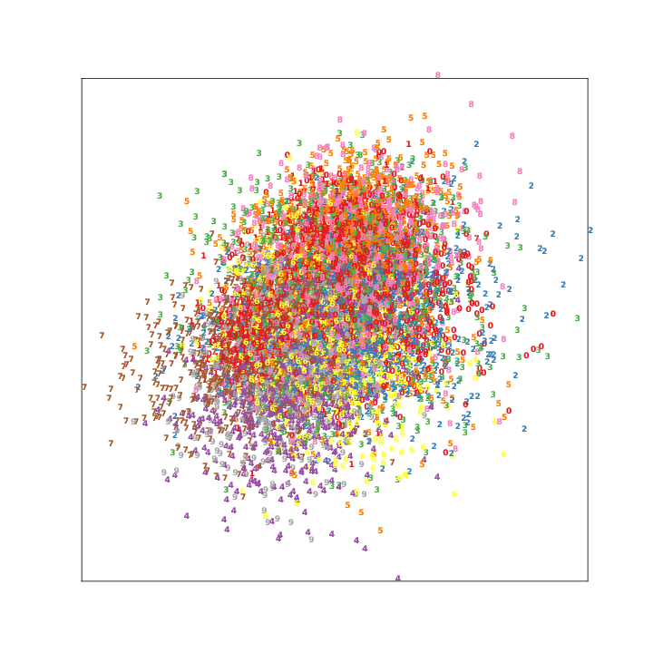
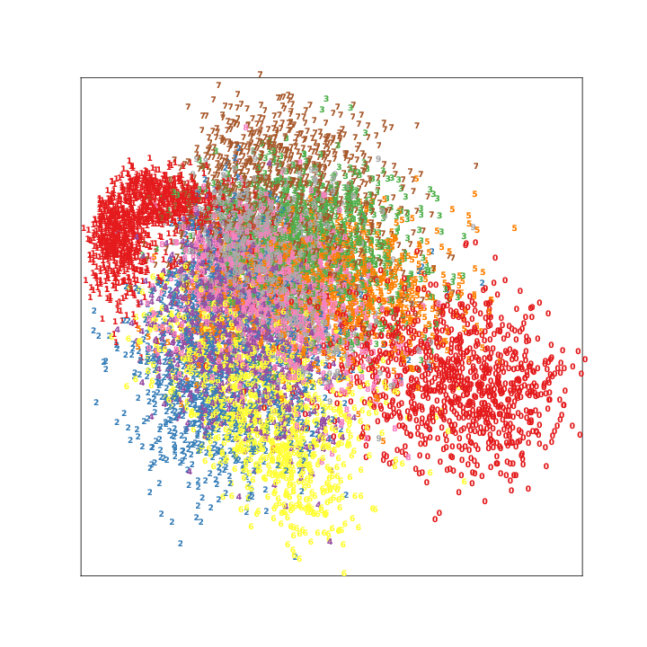
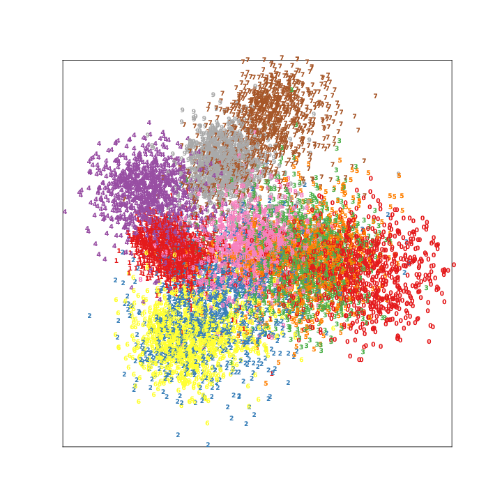
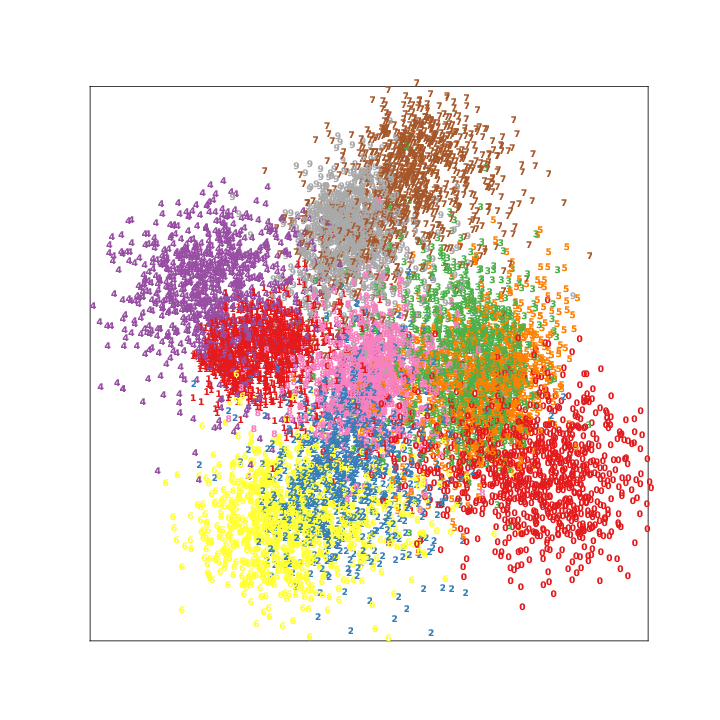
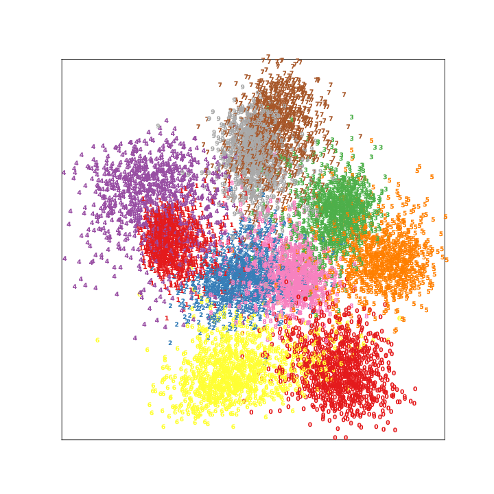
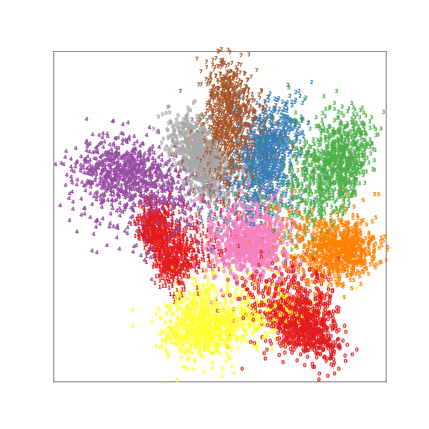
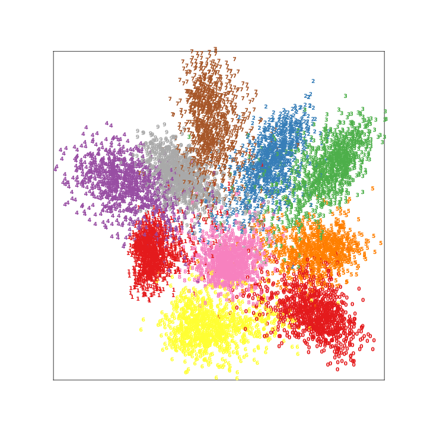
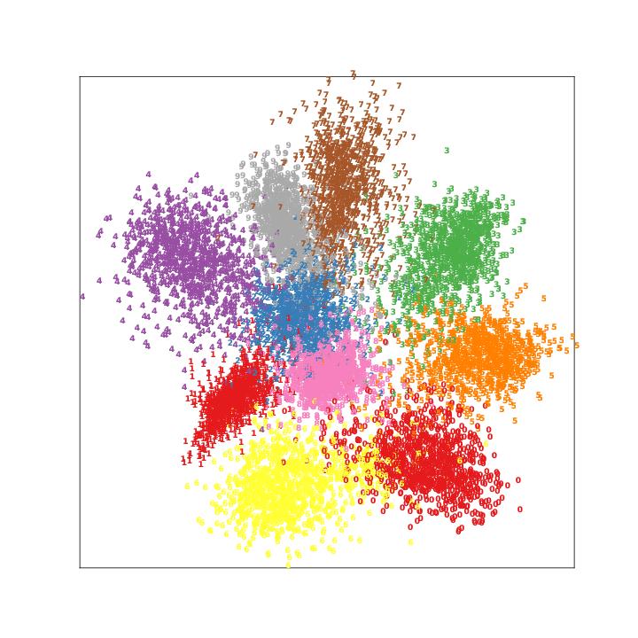

# MagnetLoss-PyTorch

PyTorch implementation of the Magnet Loss for Deep Metric Learning, based on the following paper:

* [Metric Learning with Adaptive Density Discrimination](https://research.fb.com/wp-content/uploads/2016/05/metric-learning-with-adaptive-density-discrimination.pdf?) by Oren Rippel, Piotr Dollar, Manohar Paluri, Lubomir Bourdev from Facebook AI Research that was accepted into ICLR 2016.

## Table of Contents
* [Installation](#installation)
* [Anaconda](#anaconda)
* [Docker GPU Training](#docker-gpu-training)
* [Results](#results)
* [Citing MagnetLoss-PyTorch](#citing-magnetloss-pytorch)

## Installation

The program requires the following dependencies (easy to install using pip, Ananconda or Docker):

* python (tested on 2.7 and 3.6)
* pytorch (tested with v0.3 and v0.3.1 with CUDA 8.0/9.0)
* numpy
* matplotlib
* seaborn
* pandas
* tqdm
* pillow
* sklearn
* scipy
* visdom

## Anaconda

#### Anaconda: Installation

To install MagnetLoss in an Anaconda environment:

```sh
(Python 2.7) conda env create -f pytorch-2p7-cuda80.yml
(Python 3.6) conda env create -f pytorch-3p6-cuda80.yml
```

To activate Anaconda environment:

```sh
(Python 2.7) source activate magnet-loss-py27-env
(Python 3.6) source activate magnet-loss-py36-env
```

### Anaconda: Train

Train ConvNet with Magnet Loss on the local machine using MNIST dataset:

```sh
python magnet_loss_test.py --lr 1e-4 --batch-size 64 --mnist --magnet-loss
```

## Docker GPU Training

### Prerequisites:
1. Docker installed on your machine. If you don't have Docker installed already, then go here to [Docker Setup](https://docs.docker.com/engine/getstarted/step_one/)
2. Install `nvidia-docker 2.0` from [Nvidia Docker 2.0](https://github.com/nvidia/nvidia-docker/wiki/Installation-(version-2.0))
3. Register `nvidia` runtime with the Docker engine using [Nvidia Container Runtime](https://github.com/NVIDIA/nvidia-container-runtime)

### Docker: Build Image
```sh
docker build -t magnetloss .
```

### Docker: Train
Deploy and train on Docker container:
```sh
docker run --rm -it --runtime=nvidia magnetloss python magnet_loss_test.py --lr 1e-4 --mnist --batch-size 64 --magnet-loss
```
or
```sh
./run_gpu_docker.sh magnetloss
```

## Results
### MNIST
| Iterations 	| Learned Embedding Space 	|
|:------------:	|:---------------:	|
|0 | |
|2000 | |
|4000 | |
|6000 | |
|8000 | |
|10000 | |
|12000 | |
|14000 | |

### Citing MagnetLoss-PyTorch
If you use MagnetLoss-PyTorch in a scientific publication, I would appreciate references to the source code.

Biblatex entry:

```latex
@misc{MagnetLossPyTorch,
  author = {Thangarasa, Vithursan},
  title = {MagnetLoss-PyTorch},
  year = {2018},
  publisher = {GitHub},
  journal = {GitHub repository},
  howpublished = {\url{https://github.com/vithursant/MagnetLoss-PyTorch}}
}
```
